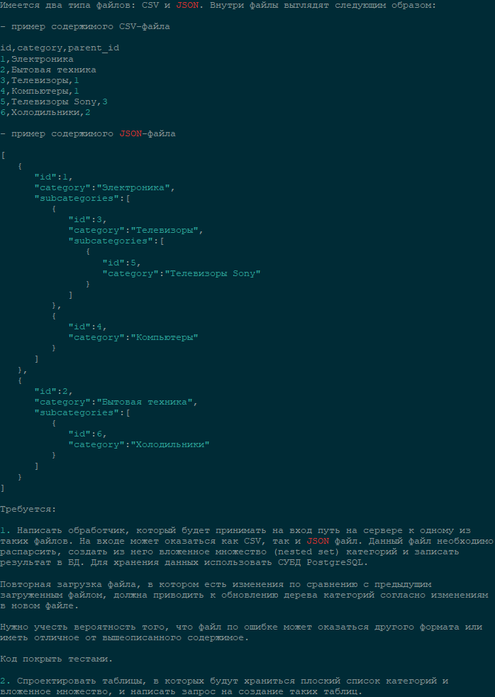

## Тестовое задание

1) Написал обработчик, который принимает имя файла из storage\app\public и обновляет
записи в бд. Те записи, которые уже были в бд - обновляются, те записи, которых не было - 
   добавляются. Не совсем оптимальынй обработчик в плане обновления данных (по хорошему
   надо брать только те записи, которые есть в файле и базе и проверять на изменения, а не 
   обновлять по id все, что найдет).
   1. Попытался учесть большую часть проверок (расширение файла, существование и т.д.).
   2. Попытался что-то покрыть тестами) 
   

2) Не совсем верно выполнил этот пункт. Мне понравилась простая структура csv файла,
поэтому я решил сделать такую же таблицу. А вложенное множество json я привел к плоскому 
   списку. Таблицу создавал средствами laravel с помощью миграций. 

Первый раз работал с postgreSQL и писал тесты - Спасибо за такое интересное тестовое задание!
███████████████████████████████████████████████████████████████████████████████████████████
███████████████████████████████████████████▀▀▀▀▀▀▀▀▀▀██████████████████████████████████████
███████████████████████████████████████▀░░░░░░░░░░░░░░░▀▀██████████████████████████████████
████████████████████████████████████▀░░░░░░░░░░░░░░░░░░░░░▀▀███████████████████████████████
██████████████████████████████████▀░░▄██████▄░░░░░▄▄██████▄░░██████████████████████████████
█████████████████████████████████▀░░████▀▀▀███▄░░▄███▀▀▀███▄░░▀████████████████████████████
████████████████████████████████░░░░▀▀▀░░░░░▀▀▀░░▀▀▀░░░░░▀██░░░▀███████████████████████████
███████████████████████████████▀░░░░░░░░░░░░░░░░░░░░░░░░░░░░░░░░███████████████████████████
███████████████████████████████░░██████████████████████████████░░██████████████████████████
███████████████████████████████░░███▀▀▀▀▀███▀▀▀▀▀▀▀▀███▀▀▀▀▀███░░██████████████████████████
███████████████████████████████░░███░░░░░███░░░░░░░░███░░░░░███░░██████████████████████████
███████████████████████████████░░███░░░░░███░░░░░░░░███░░░░▄███░▄██████████████████████████
████████████████████████████████░░███░░░░███░░░░░░░░███░░░░███░░███████████████████████████
████████████████████████████████▄░▀███▄░░███░░░░░░░░███░░▄███░░████████████████████████████
█████████████████████████████████▄░░████▄███░░░░░░░░███▄███▀░░█████████████████████████████
███████████████████████████████████░░▀██████▄░░░░░░▄█████▀▀░▄██████████████████████████████
████████████████████████████████████▄▄░░▀▀████████████▀▀░░▄████████████████████████████████
███████████████████████████████████████▄▄░░░░▀▀▀▀▀▀░░░▄▄███████████████████████████████████
████████████████████████████████████████████▄▄▄▄▄▄▄▄███████████████████████████████████████
███████████████████████████████████████████████████████████████████████████████████████████
   
